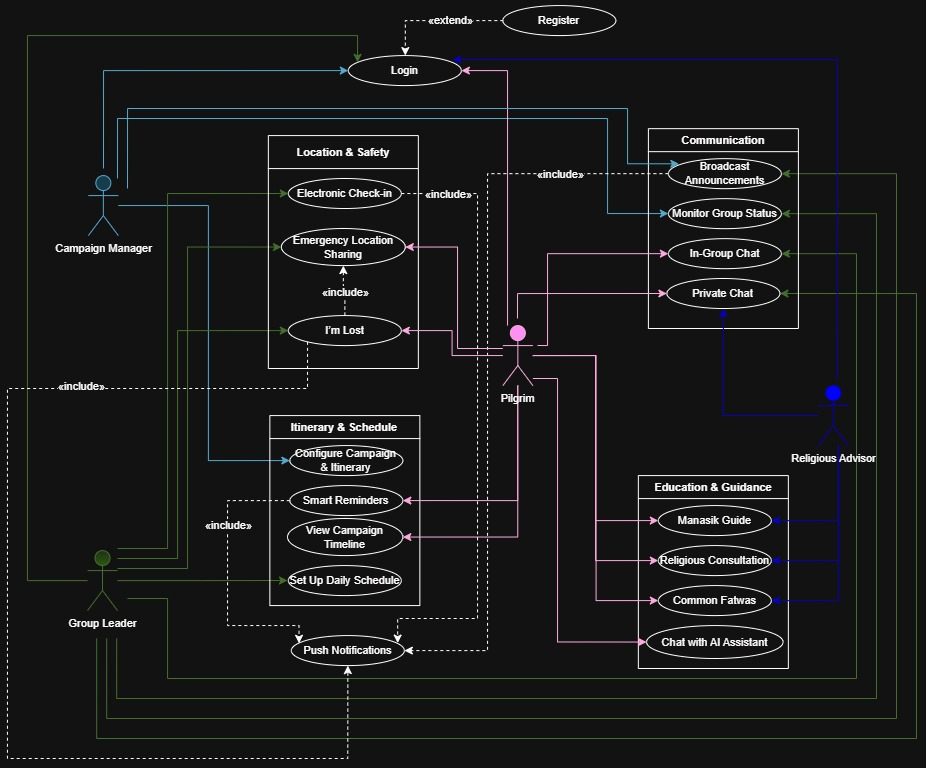
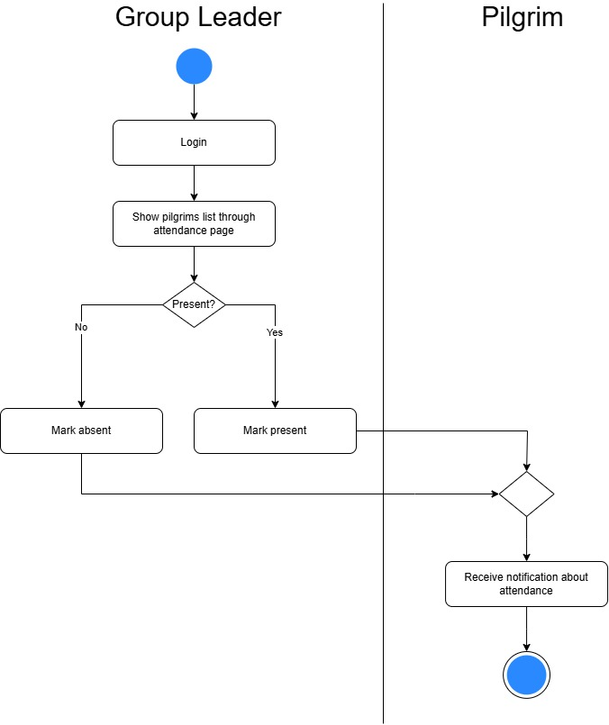
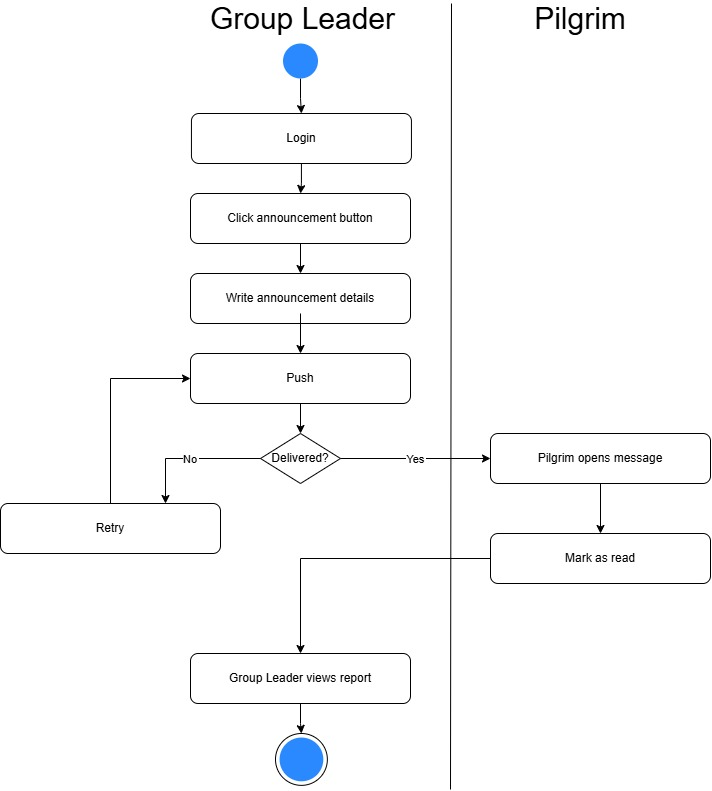
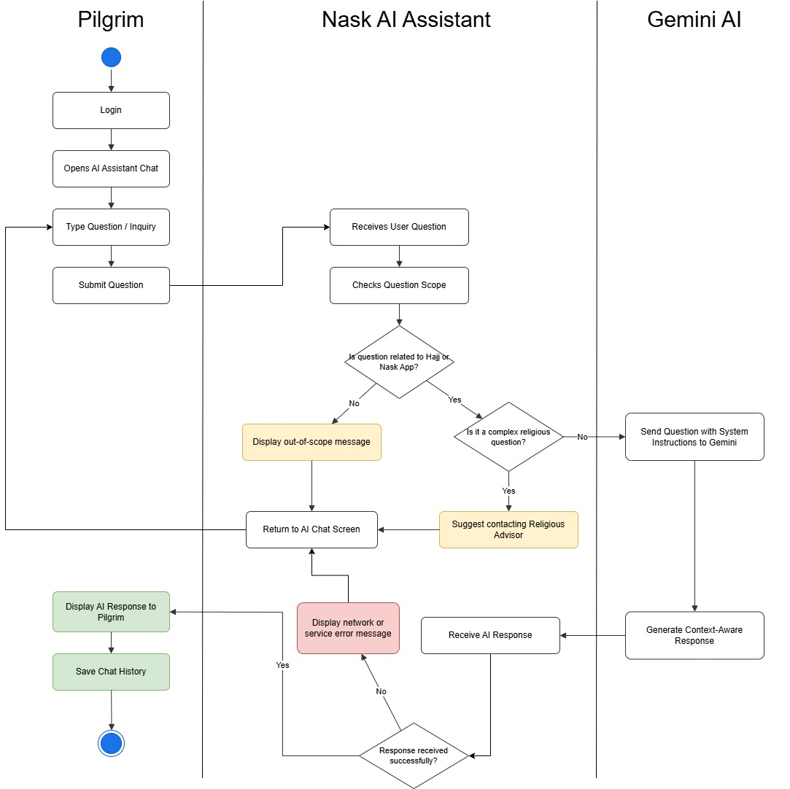

# Nask – Hajj Campaign Management App 🕋

### Graduation Project | Computer Information Systems  
A role-based mobile application designed to improve communication, coordination, and safety inside private Hajj campaign companies.

 

---

## Overview

**Nask** is a graduation project designed to support private Hajj campaign companies by organizing internal communication, coordination, and pilgrim support through one integrated mobile application.

The project addresses common challenges in traditional campaign management, such as scattered communication channels, delayed instructions, difficulty tracking pilgrims, manual check-in, and limited access to organized religious guidance.

Nask provides a role-based experience for **Pilgrims, Group Leaders, Religious Advisors, and Campaign Managers**, allowing each user type to access the features they need through a clear and structured interface.

---

## Project Purpose

The main purpose of Nask is to improve the operational experience inside Hajj campaigns by transforming manual and scattered processes into a more organized digital workflow.

The app focuses on:

- Improving communication between campaign members
- Supporting emergency response through SOS alerts
- Organizing check-in and group tracking
- Providing religious and educational support
- Supporting campaign managers with better visibility and coordination
- Enhancing the overall pilgrim experience during Hajj

---

## My Role

- System analysis and documentation
- UI/UX design and user flow structuring
- Database and Firestore collections planning
- Designing 40+ mobile app interfaces
- Preparing UML diagrams and project documentation
- Creating diagrams using Draw.io
- Presenting the project through a final report, poster, and project showcase

---

## Main Users

| User Type | Description |
|---|---|
| **Pilgrim** | Uses the app for guidance, check-in, SOS alerts, learning materials, AI support, and communication. |
| **Group Leader** | Manages assigned pilgrims, receives alerts, follows group status, and communicates with pilgrims. |
| **Religious Advisor** | Receives and answers religious questions from pilgrims. |
| **Campaign Manager** | Manages users, groups, announcements, campaign coordination, and overall system activity. |

---

## Key Features

| Feature | Description |
|---|---|
| **Role-Based Dashboards** | Each user type has a dedicated interface and access to relevant features. |
| **Emergency SOS** | Allows pilgrims to send emergency alerts with location support. |
| **Check-in System** | Helps organize attendance and group tracking during campaign activities. |
| **Chat & Consultation** | Supports communication between pilgrims, group leaders, and religious advisors. |
| **AI Assistant** | Provides smart support and general guidance for pilgrims. |
| **Religious Advisor Support** | Allows pilgrims to send religious questions and receive organized responses. |
| **Learning Materials** | Provides educational content related to Hajj and Manasik guidance. |
| **Notifications & Announcements** | Supports campaign updates, instructions, and important alerts. |
| **Firestore Structure** | Uses NoSQL collections to organize users, groups, chats, questions, SOS cases, schedules, and learning data. |

---

## Selected UI Screens

<table>
  <tr>
    <td align="center"><strong>Home Page</strong> </td>
    <td align="center"><strong>Check-in Page</strong> </td>
    <td align="center"><strong>Chats Page</strong> </td>
    <td align="center"><strong>AI Chat Page</strong> </td>
  </tr>
  <tr>
    <td align="center"><strong>Learn Page</strong> </td>
    <td align="center"><strong>Group Leader Chats</strong> </td>
    <td align="center"><strong>Control Panel</strong> </td>
    <td align="center"><strong>Manager Control Panel</strong> </td>
  </tr>
</table>

---

## Full UI Screens

Click to view all uploaded interface screens

 

<table>
  <tr>
    <td align="center"><strong>Home Page 1</strong> </td>
    <td align="center"><strong>Home Page 2</strong> </td>
    <td align="center"><strong>Login Page 1</strong> </td>
    <td align="center"><strong>Login Page 2</strong> </td>
  </tr>

  <tr>
    <td align="center"><strong>Registration</strong> </td>
    <td align="center"><strong>Recovery</strong> </td>
    <td align="center"><strong>Learn Page</strong> </td>
    <td align="center"><strong>Tawaf Learning</strong> </td>
  </tr>

  <tr>
    <td align="center"><strong>Chats Page</strong> </td>
    <td align="center"><strong>AI Chat Page</strong> </td>
    <td align="center"><strong>Answer Question</strong> </td>
    <td align="center"><strong>Questions Page</strong> </td>
  </tr>

  <tr>
    <td align="center"><strong>Check-in Page</strong> </td>
    <td align="center"><strong>Map Page</strong> </td>
    <td align="center"><strong>Im-lost Page</strong> </td>
    <td align="center"><strong>Im-lost Cases</strong> </td>
  </tr>

  <tr>
    <td align="center"><strong>Control Panel</strong> </td>
    <td align="center"><strong>Manager Control Panel</strong> </td>
    <td align="center"><strong>Group Leader Chat</strong> </td>
    <td align="center"><strong>Group Leader Chats</strong> </td>
  </tr>

  <tr>
    <td align="center"><strong>Group Leader Im-lost</strong> </td>
    <td align="center"><strong>Group Leader Notifications</strong> </td>
    <td align="center"><strong>Notifications Page</strong> </td>
    <td align="center"><strong>Notification Page</strong> </td>
  </tr>

  <tr>
    <td align="center"><strong>Notification Details</strong> </td>
    <td align="center"><strong>Notifications to Group Leaders</strong> </td>
    <td align="center"><strong>List of Groups</strong> </td>
    <td align="center"><strong>Pilgrim List</strong> </td>
  </tr>

  <tr>
    <td align="center"><strong>Welcoming 2</strong> </td>
    <td align="center"><strong>Welcoming 3</strong> </td>
  </tr>
</table>

---

## System Analysis Diagrams

The project includes UML and activity diagrams to represent the system structure, user interactions, and main process flows.  
The diagrams were designed using **Draw.io**.

<table>
  <tr>
    <td align="center"><strong>Use Case Diagram</strong> </td>
  </tr>
  <tr>
    <td align="center"><strong>Class Diagram</strong> </td>
  </tr>
</table>

Click to view activity diagrams

 

<table>
  <tr>
    <td align="center"><strong>Registration & Login</strong> </td>
  </tr>
  <tr>
    <td align="center"><strong>Check-in</strong> </td>
  </tr>
  <tr>
    <td align="center"><strong>Emergency SOS</strong> </td>
  </tr>
  <tr>
    <td align="center"><strong>Religious Advisor Chat</strong> </td>
  </tr>
  <tr>
    <td align="center"><strong>Announcements</strong> </td>
  </tr>
  <tr>
    <td align="center"><strong>AI Assistant</strong> </td>
  </tr>
</table>

---

## Technologies & Tools

| Category | Tools / Technologies |
|---|---|
| Mobile Development | Flutter, Dart |
| Backend & Database | Firebase, Firestore |
| Authentication & Access | Firebase Authentication, role-based access |
| AI Support | Gemini AI |
| System Modeling | UML, Use Case, Activity, Class Diagrams |
| Diagram Design | Draw.io |
| UI/UX | Role-based screens, user flows, Arabic RTL interface |
| Documentation | Technical documentation, system analysis, final project report |

---

## Project Value

Nask focuses on solving common coordination challenges in Hajj campaigns by replacing scattered tools and manual processes with a unified digital experience.

The project demonstrates skills in:

- Business and system analysis
- Requirements documentation
- Database and Firestore structure design
- UI/UX and user flow design
- Technical documentation
- Role-based access planning
- Digital transformation thinking

---

## Source Code Notice

This repository is created as a **project showcase**.

The full source code is kept private due to project, team, and configuration sensitivity.

---

**Developed as a Graduation Project – Taibah University**  
Computer Information Systems

